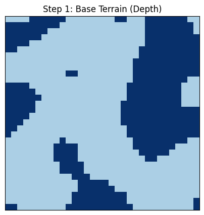
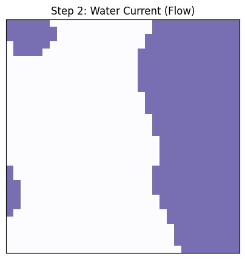
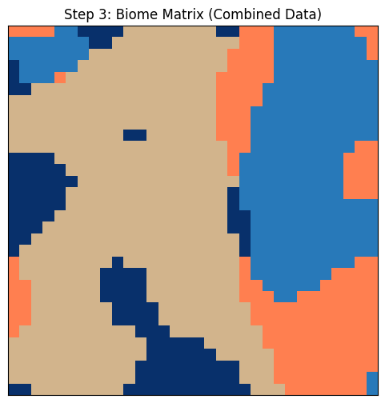
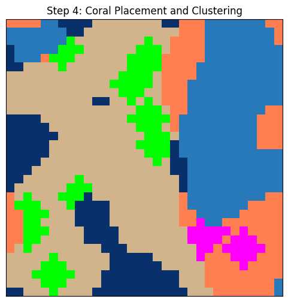
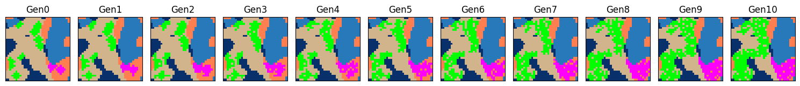
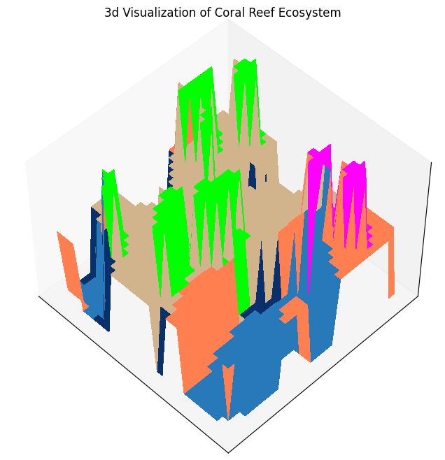

# AI-Driven Map Generation with Evolving Coral Ecosystem
This repository contains the entry task for **AI-Driven Dynamic Procedural Map Generation System** Project.

The script contains a deterministic procedural generation system using Perlin noise and also simulates ecosystem evolution.

## Methodology
The script generates the environment and simulates the evolution through the following steps:

1. **Terrain Map:** Generates a Perlin noise map of the seabed with two depth values - Deep: `0` and Shallow: `1`.
2. **Current Map:** Generates a Perlin noise map of the water current strength with two values - Weak: `0` and Strong: `1`.
3. **Biome Matrix:** Combines the Terrain and Current maps to create a biome matrix with 4 different values - `0`, `1`, `2` and `3`.
4. **Coral Placement (Gen 0):** Places corals of two types (`1` and `2`) based on their feasible biomes (`3` and `2` respectively) and simulates initial clustering.
5. **Ecosystem Simulation (Cellular Automata):** Simulates the growth and decay of the corals based on defined rules, for a set amount of timesteps (10).
6. **3d Visualization:** Produces a 3d visual map of the initial Coral placement (Gen 0). X and Y axes represent the grid, Z axis represents the vertical height (Deep: `Z=0`, Shallow: `Z=1`, Coral: `Z=2`).

## Installation and Usage

### Installation
Before executing the script, you will need to install python. This project was developed on Python 3.13.5 . \
After installing python, install the required dependencies using:
```bash
pip install -r requirements.txt
```

### Running the Script
Simply execute the script using:
```bash
python main.py
```
When executed, the script will output images for each step sequentially.
The outputs are completely deterministic. Using the same seed will provide same outputs every time.

## Configurable Parameters
The script uses parameters which can be tweaked to yield different outputs.

### Environment Parameters
- `width`x`height` (default = `32x32`): Defines the size of the environment grid.
- `scale` (default = `10.0` for depth map, `20.0` for current map): Defines the scale of the generated noise map.
- `seed` (default = `42`, `1337` for current map): Ensures deterministic behaviour for terrain map, current map and initial coral placement.
- `octaves` (default = `1`): Determines the number of noise layers used to generate the terrain and current maps. `1` produces smooth boundaries. Higher the value, more detailed the maps will be.

### Simulation Parameters
- `spawn_attempts` (default = `20`): Amount of attempts made to place the corals. If the selected tile is valid for a coral, that coral will be placed.
- `cluster_size` (default = `2`): Number of iterations for which the coral will grow on valid tiles before the simulation begins.
- **Growth Probabilities:** Probability that a coral grows in the next valid tile. Coral-1 has `40%` chance and Coral-2 has `20%` chance.
- **Decay Rule:** If a coral is surrounded by 3 or more neighbouring corals, then there is a `5%` chance for this coral to decay due to lack of nutrients.

## Sample Outputs
1. **Terrain Map**: Deep and Shallow water.
<p align="center">
  
</p>

2. **Current Map**: Weak and Strong water current.
<p align="center">
  
</p>

3. **Biome Matrix**: Combination of terrain and current maps resulting in 4 biomes.
<p align="center">
  
</p>

4. **Initial Coral Placement**: Inital coral parent placement and formation  of clusters.
<p align="center">
  
</p>

5. **Simulated Ecosystem Evolution**: Ecosystem at each timestep from Gen 0 to Gen 10.


6. **3D Visualization**: 3D surface plot of initial coral placement (Gen 0)
<p align="center">
  
</p>

### Colour Legend
- **Dark Blue**: Deep with Weak water current
- **Light Blue**: Deep with Strong water current
- **Beige**: Shallow with Weak water current
- **Orange**: Shallow with Strong water current
- **Pink**: Coral-1
- **Green**: Coral-2